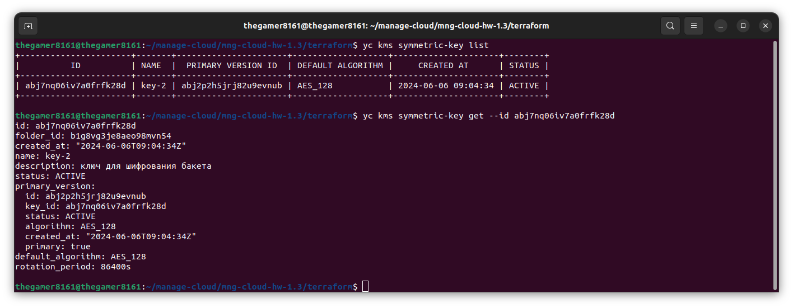
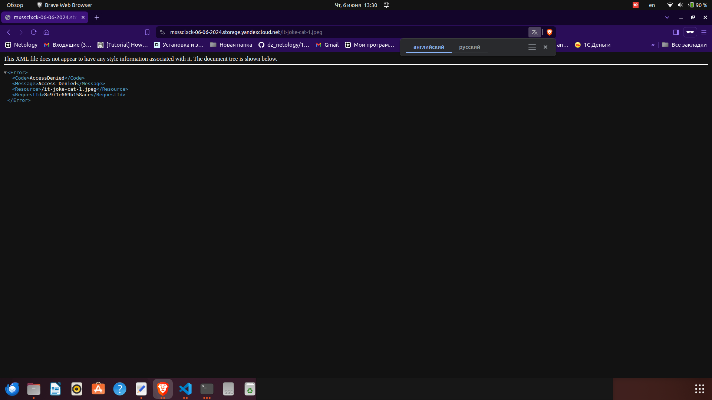
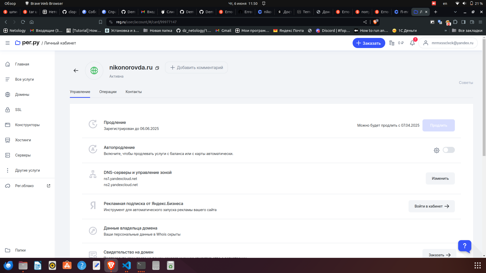
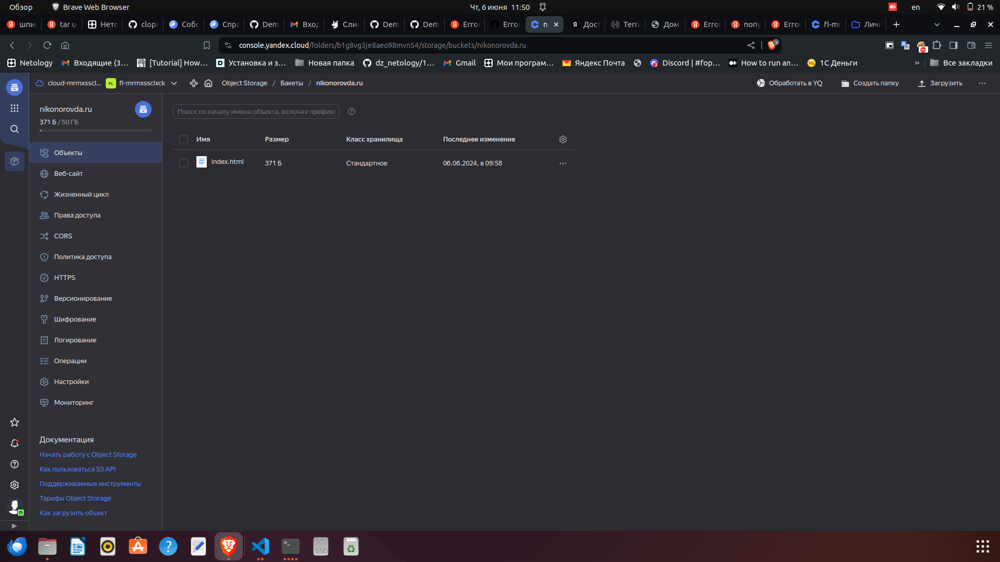
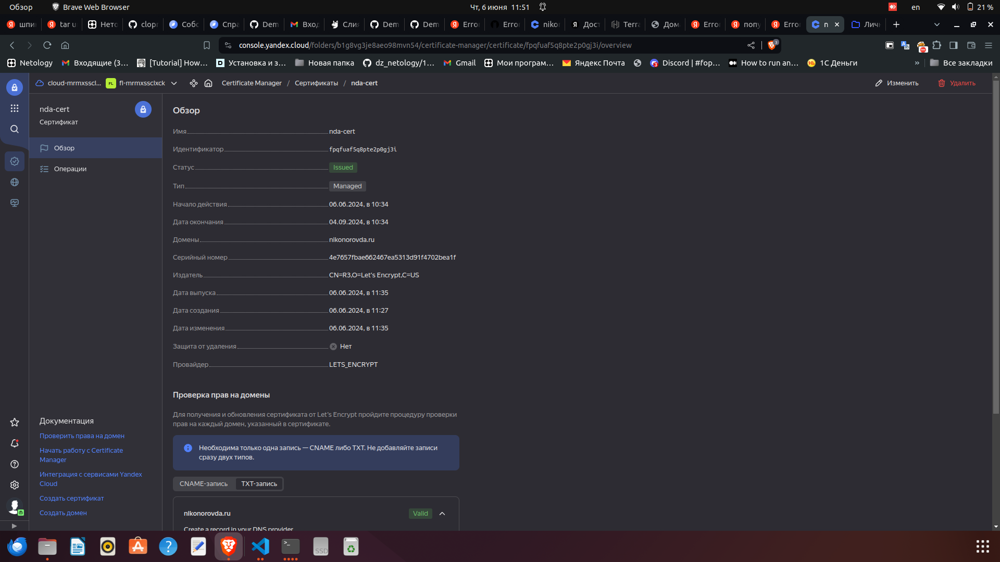
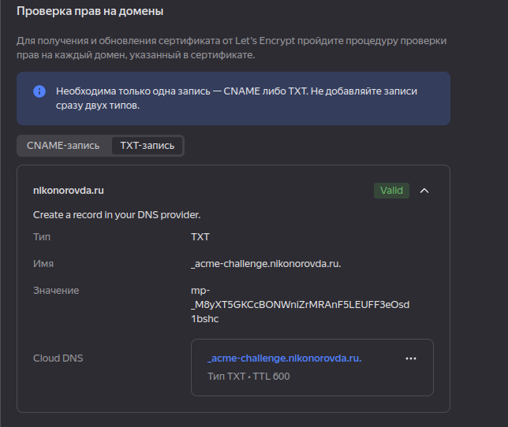
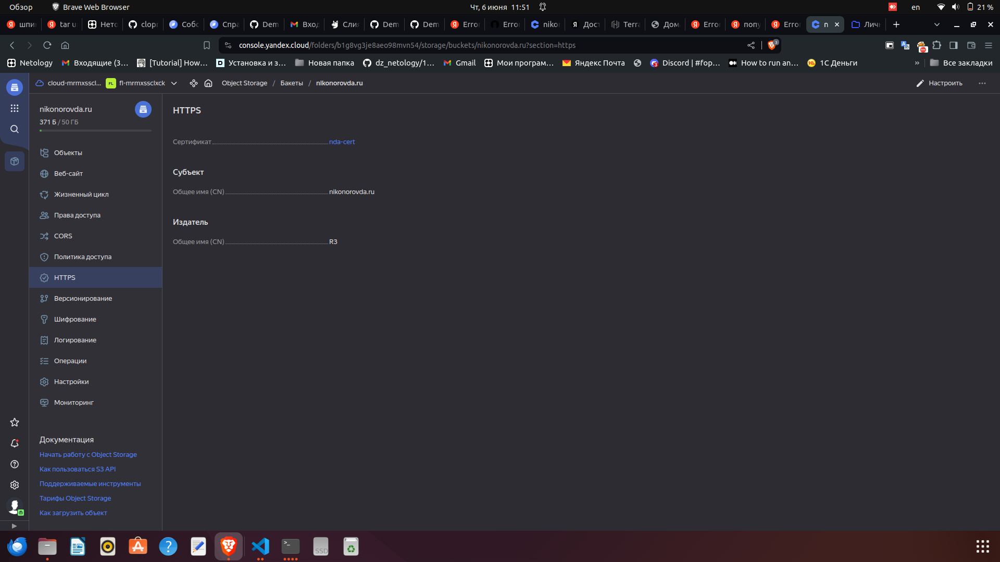
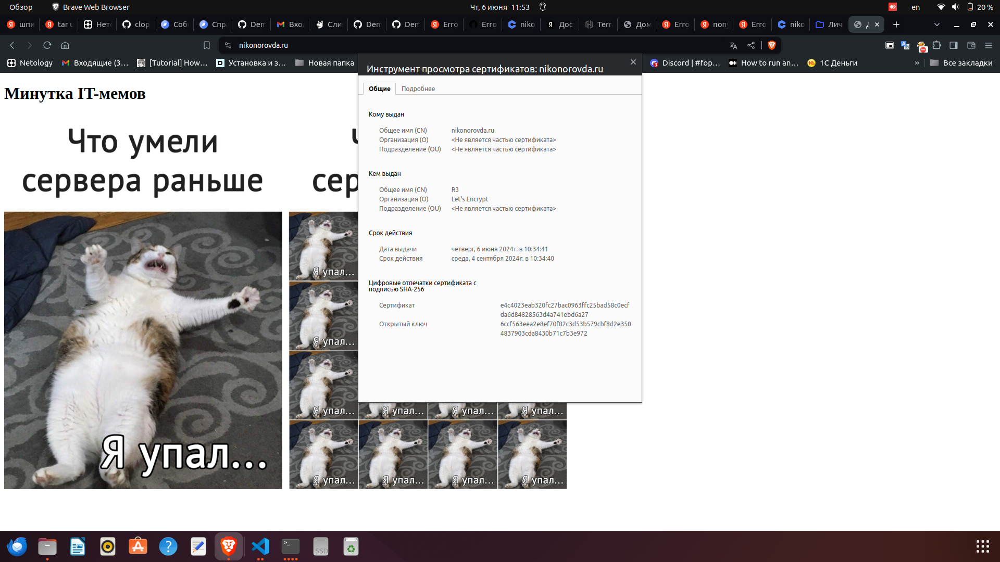

# Никоноров Денис - FOPS-8

# Домашнее задание к занятию «Безопасность в облачных провайдерах»

Используя конфигурации, выполненные в рамках предыдущих домашних заданий, нужно добавить возможность шифрования бакета.

---
## Задание 1. Yandex Cloud

1. С помощью ключа в KMS необходимо зашифровать содержимое бакета:

 - создать ключ в KMS;
 - с помощью ключа зашифровать содержимое бакета, созданного ранее.
2. (Выполняется не в Terraform)* Создать статический сайт в Object Storage c собственным публичным адресом и сделать доступным по HTTPS:

 - создать сертификат;
 - создать статическую страницу в Object Storage и применить сертификат HTTPS;
 - в качестве результата предоставить скриншот на страницу с сертификатом в заголовке (замочек).

--- 

## Выполнение задания 1. Yandex Cloud
Взял код из предыдущей ДЗ т.к в нем уже есть бакет и загрузка изображения.

Создана роль для службы KMS, которая даст возможность зашифровать и расшифровать данные:

```terraform

resource "yandex_resourcemanager_folder_iam_member" "sa-editor-encrypter-decrypter" {
  folder_id = var.folder_id
  role      = "kms.keys.encrypterDecrypter"
  member    = "serviceAccount:${yandex_iam_service_account.service.id}"
}

```

Создан симметричный ключ шифрования с алгоритмом AES_128 и временем жизни 24 часа.

```terraform

resource "yandex_kms_symmetric_key" "secret-key" {
  name              = "key-2"
  description       = "ключ для шифрования бакета"
  default_algorithm = "AES_128"
  rotation_period   = "24h"
}

```

Применен ключ шифрования к сазданному бакету:

```terraform

server_side_encryption_configuration {
    rule {
      apply_server_side_encryption_by_default {
        kms_master_key_id = yandex_kms_symmetric_key.secret-key.id
        sse_algorithm     = "aws:kms"
      }
    }
  }

```

Проверим результат



Ключ шифрования создан

Попытаемся открыть зашифрованный файл



Доступа нет т.к он зашифрован

Выполнения задания в рег ру зарегал домени записаны NS записи yandexcloud.net



Создан бакет и загружен index.html



Создан запрос на сертификат Let's Encrypt + DNS подтверждения подлинности сайта.





Сертификат стал валидным

Включен HTTPS выбрав сертификат выпущенный Let's Encrypt



Проверим в браузере домен nikonorovda.ru



Видим что серитфикат подключен!